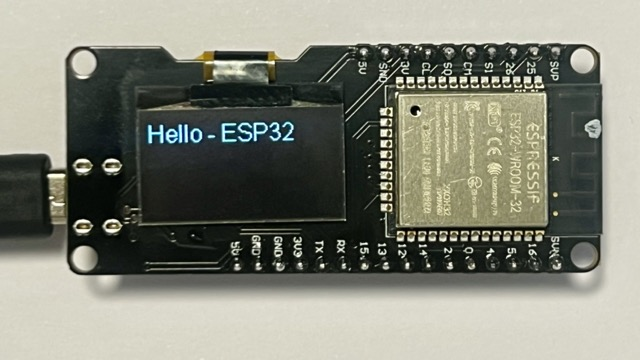
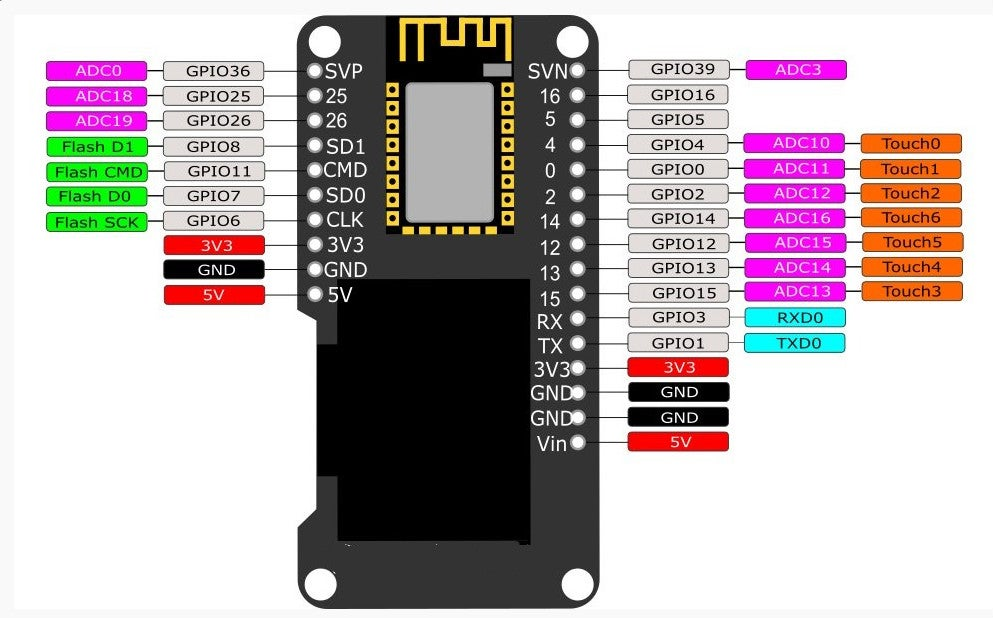

# Control de humedad en el trastero.

  Se trata de controlar la humedad en un recinto pequeño ( unos 7 m2) utilizando un extractor y un pequeño deshumidificados de unos pocos litros.
   Se utilizan dos sensores DHT21 y dos relés para control del extactor y deshumidificador. Como microcontrolador se usa un clone Semos Esp32 con pantalla OLED. 


Como base para la creación de un proyecto en PlatformIo, se utiliza el siguiente repositorio :

Bootstrap program for Wemos Lolin ESP32 OLED board (and clones)
--

This program allows you a quick start with the Wemos Lolin ESP32 OLEun cD, which features a 0.96" display. Documentation online about the pinout is sketchy and, in some cases, wrong. 

The important thing is that to communicate with the display, you need to use I2C, talking to the SSD1306 controller. The I2C address and I2C pins are:

```C++
#define I2C_DISPLAY_ADDR    0x3C
#define SDA                 5
#define SCL                 4
```

Here's a photo of a Lolin clone running the "Hello World" code:



Here's the pinout of the module for future reference:



Please also check this documentation:
* [Random Nerd Tutorials -- WEMOS LOLIN](https://randomnerdtutorials.com/esp32-built-in-oled-ssd1306/)
* [ESP32-WROOM-32 with 0.96" OLED by Melife](https://www.technologyx2.com/blog_hightech/2020/5/24/research-esp32esp-wroom-32-development-board-with-096-oled-by-melife)

## Control de Humedad — Esquema de conexiones

### Componentes

| Componente               | Cantidad |
|--------------------------|----------|
| Wemos Lolin ESP32 (OLED integrado) | 1 |
| Sensor DHT21 (AM2301)    | 2        |
| Módulo relé 2 canales (activo LOW) | 1 |
| Extractor de aire        | 1        |
| Deshumidificador Peltier | 1        |

### Tabla de pines

| Señal               | GPIO ESP32 | Notas                        |
|---------------------|-----------|------------------------------|
| OLED SDA            | GPIO 5    | Integrado en la placa        |
| OLED SCL            | GPIO 4    | Integrado en la placa        |
| DHT21 (AM2301) interior DATA | GPIO 13   | Pull-up 10 kΩ a 3.3 V       |
| DHT21 (AM2301) exterior DATA | GPIO 14   | Pull-up 10 kΩ a 3.3 V       |
| Relé extractor IN   | GPIO 26   | Activo LOW                   |
| Relé deshumid. IN   | GPIO 25   | Activo LOW                   |
| Botón pantalla      | GPIO 12   | Pull-up interno; GND al pulsar |

### Diagrama de bloques

```
                        ┌─────────────────────────────────┐
                        │      Wemos Lolin ESP32           │
                        │                                  │
   DHT21 (AM2301) (interior) ────┤ GPIO13          GPIO26 ├──── Relé CH1 ──► Extractor
                        │                                  │
   DHT21 (AM2301) (exterior) ────┤ GPIO14          GPIO25 ├──── Relé CH2 ──► Deshumidificador
                        │                                  │
              Botón ────┤ GPIO12                           │
                        │                                  │
                        │   GPIO4/5 (I2C)                  │
                        │      │                           │
                        │   OLED SSD1306 (integrado)       │
                        └─────────────────────────────────┘
```

### Cableado de los sensores DHT21 (AM2301)

Cada DHT21 (AM2301) se conecta del mismo modo:

```
DHT21 (AM2301)
 ┌───┐
 │ 1 ├──── VCC (3.3 V)
 │   │         │
 │ 2 ├──── DATA ──┬──► GPIO13 (interior) / GPIO14 (exterior)
 │   │            │
 │   │          10 kΩ (pull-up a 3.3 V)
 │ 3 │  (no conectar)
 │ 4 ├──── GND
 └───┘
```

### Cableado del botón de pantalla

El botón activa la pantalla OLED durante 30 segundos. Usa el pull-up interno del ESP32,
por lo que no necesita resistencia externa.

```
ESP32          Botón
GPIO12 ────── [  ]
GND    ────── [  ]
```

Al pulsar, GPIO12 cae a GND (flanco descendente). En reposo permanece en HIGH gracias al pull-up interno.

### Cableado del módulo de relé (2 canales)

```
Módulo relé          ESP32
┌──────────┐
│ VCC      ├──── 5 V  (o 3.3 V según módulo)
│ GND      ├──── GND
│ IN1      ├──── GPIO26  (extractor)
│ IN2      ├──── GPIO25  (deshumidificador)
│          │
│ COM1/NO1 ├──── Fase ──► Extractor
│ COM2/NO2 ├──── Fase ──► Deshumidificador
└──────────┘
```

> **Nota de seguridad:** Los relés conmutan la línea de red (230 V AC). Utiliza siempre
> un módulo con optoacoplador y asegúrate de aislar correctamente los bornes de alta tensión.

## Lógica de control

### Máquina de estados

El sistema tiene cuatro estados posibles:

| Estado | Extractor | Deshumidificador | Condición de entrada |
|---|---|---|---|
| `IDLE` | OFF | OFF | Humedad interior ≤ 65 % |
| `EXTRACTOR_ON` | ON | OFF | Humedad interior > 70 % **y** exterior ≥ 10 % menor |
| `DEHUMID_ON` | OFF | ON | Humedad interior > 70 % y exterior no ayuda |
| `SAFE_OFF` | OFF | OFF | ≥ 5 lecturas consecutivas fallidas en cualquier sensor |

### Criterio de selección de actuador

Cuando la humedad interior supera el 70 %:

```
humedad_interior - humedad_exterior >= 10 %
        ↓ SÍ                  ↓ NO
  EXTRACTOR_ON          DEHUMID_ON
  (ventilar)            (Peltier)
```

El extractor tiene prioridad porque es más eficiente energéticamente.
Si el aire exterior no está suficientemente seco, se recurre al deshumidificador.

### Histéresis

La banda entre 65 % y 70 % evita el encendido/apagado repetitivo (*chatter*):

```
         ┌─ activa dispositivo
  70 % ──┤
         │  (banda: mantiene estado actual)
  65 % ──┤
         └─ apaga dispositivo
```

### Seguridad

Si cualquier sensor acumula 5 lecturas fallidas consecutivas, ambos relés
se apagan inmediatamente (`SAFE_OFF`). La recuperación es automática en
cuanto vuelve a haber una lectura válida.

---

## Ciclos de lectura adaptativos

Los cambios de humedad en un trastero son lentos (escala de minutos/horas),
por lo que la frecuencia de lectura se adapta al estado actual para ahorrar
energía y reducir el desgaste de los sensores:

| Estado | Intervalo de lectura | Motivo |
|---|---|---|
| `IDLE` | **10 min** | Humedad estable; solo vigilar que no supere 70 % |
| `EXTRACTOR_ON` | **2 min** | Detectar cuándo la humedad baja a 65 % |
| `DEHUMID_ON` | **5 min** | La célula Peltier es más lenta |
| `SAFE_OFF` | **30 s** | Recuperación rápida del fallo de sensor |

Adicionalmente, cada vez que el sistema cambia de estado se realiza una
**lectura de confirmación a los 30 segundos** para verificar que el
actuador está teniendo efecto antes de entrar en el intervalo largo.

### Comparativa de lecturas diarias

| Situación | Sin adaptar (2 s fijo) | Con intervalos adaptativos |
|---|---|---|
| Día sin problemas (IDLE todo el día) | 43.200 | **144** |
| Extractor activo 2 horas | 43.200 | ~220 |

---

## Arquitectura software

El firmware usa **FreeRTOS** con cuatro tareas concurrentes:

```
Core 1  taskSensors  prio 3  Lee DHT21 (AM2301) con intervalos adaptativos
Core 1  taskControl  prio 2  Evalúa estado y activa/desactiva relés
Core 0  taskDisplay  prio 1  Refresca la pantalla OLED cada 500 ms
Core 0  taskBLE      prio 2  Servidor GATT BLE, notifica cada 1 s
```

Los datos compartidos (`interior`, `exterior`, `currentState`, `manualOverride`,
umbrales) están protegidos por un mutex. `taskBLE` accede a ellos con un timeout
de 100 ms para no bloquear las tareas críticas.

---

## Interfaz BLE GATT

El ESP32 anuncia el nombre **"Trastero"** y expone el servicio:

```
Servicio: 1b5ab4f0-0000-1000-8000-00805f9b34fb
```

### Tabla de characteristics

| Nombre | UUID | Propiedades | Tamaño | Descripción |
|---|---|---|---|---|
| `SENSOR_INT` | `...0001` | READ, NOTIFY | 9 bytes | Temperatura y humedad interior |
| `SENSOR_EXT` | `...0002` | READ, NOTIFY | 9 bytes | Temperatura y humedad exterior |
| `ESTADO` | `...0003` | READ, NOTIFY | 1 byte | Estado de la máquina de control |
| `CMD_ACTUADOR` | `...0010` | WRITE | 2 bytes | Comando de override manual |
| `UMBRALES` | `...0011` | READ, WRITE | 12 bytes | Umbrales de humedad |
| `HORA` | `...0012` | READ, WRITE | 4 bytes | Reloj del sistema (unix timestamp) |
| `CMD_DISPLAY` | `...0013` | WRITE | 1 byte | Enciende o apaga la pantalla OLED |

> UUID completo: reemplazar `...` por `1b5ab4f0-0000-1000-8000-0000000`

### Formatos de payload (little-endian, IEEE 754 para floats)

**SENSOR_INT / SENSOR_EXT** — 9 bytes
```
[0..3]  float   temperatura en °C
[4..7]  float   humedad relativa en % RH
[8]     uint8   1 = lectura válida, 0 = inválida
```

**ESTADO** — 1 byte
```
0 = IDLE           (humedad OK, actuadores apagados)
1 = EXTRACTOR_ON   (extractor en marcha)
2 = DEHUMID_ON     (deshumidificador Peltier en marcha)
3 = SAFE_OFF       (fallo de sensor, todo apagado)
```

**CMD_ACTUADOR** — 2 bytes (solo escritura)
```
[0]  uint8  0 = AUTO            (control automático por sensores)
            1 = FORZAR_EXTRACTOR
            2 = FORZAR_DEHUMID
            3 = FORZAR_OFF
[1]  uint8  reservado (0x00)
```

**UMBRALES** — 12 bytes
```
[0..3]   float  humedad de activación   (defecto: 70.0 %)
[4..7]   float  humedad de desactivación (defecto: 65.0 %)
[8..11]  float  delta mínimo para elegir extractor (defecto: 10.0 %)
```
> Restricción: activación > desactivación y delta > 0; si no, se rechaza.

**HORA** — 4 bytes
```
[0..3]  uint32  segundos desde epoch UTC (unix timestamp)
```

**CMD_DISPLAY** — 1 byte (solo escritura)
```
0x01 = encender pantalla 30 s
0x00 = apagar pantalla
```

### Notificaciones

Las characteristics `SENSOR_INT`, `SENSOR_EXT` y `ESTADO` envían notificaciones
automáticas cada **1 segundo** cuando hay un cliente conectado con el descriptor
CCCD activo (0x0001).

### Verificación con nRF Connect

1. Escanear y conectar a **"Trastero"**.
2. Expandir el servicio `1b5ab4f0-...`.
3. Activar notificaciones en `SENSOR_INT` / `SENSOR_EXT` / `ESTADO`.
4. Escribir `[01 00]` en `CMD_ACTUADOR` → extractor forzado.
5. Escribir `[00 00]` en `CMD_ACTUADOR` → volver a modo automático.

---

License
---
[Apache 2.0](LICENSE.txt)
